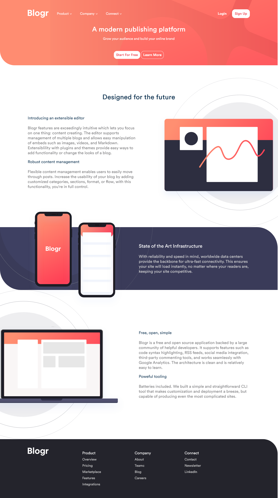
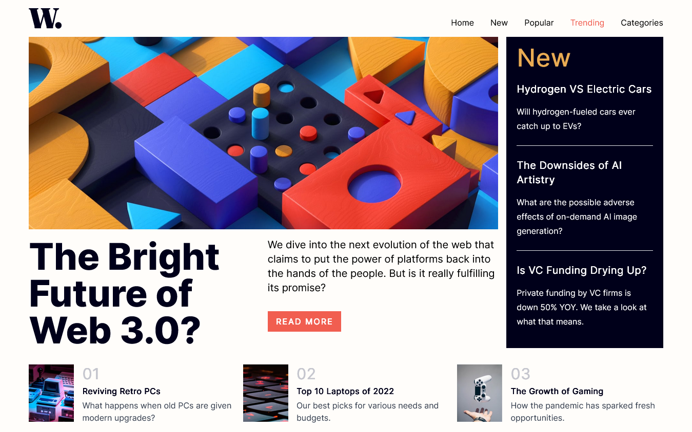
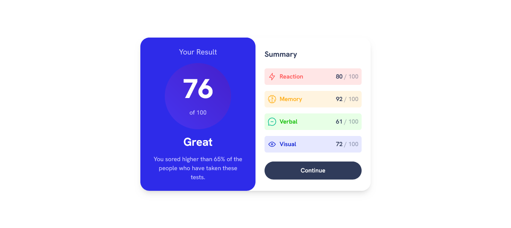

# 30-Day Developer Challenge

Welcome to my 30-Day Developer Challenge repository! This repository contains a collection of projects I created as part of the contest. Each day, for the duration of the challenge, I worked on a new project and shared it here.

## About the Challenge

The 30-Day Developer Challenge is a contest that encourages developers to work on a project every day for a month. The goal of this challenge is to learn, improve skills, and showcase creativity. Each project is built around different technologies, concepts, or problem-solving ideas.

## Projects

Here's a list of projects I worked on each day of the challenge:

### Day 1: [3 Column Preview Card Component](https://30-smoky.vercel.app/1/)


### Day 2: [Blogr Landing Page](https://30-smoky.vercel.app/2/)



### Day 3: [Bookmark Landing Page](https://30-smoky.vercel.app/3/)


Frameworks: React.js

### Day 4: [Age Calculator App](https://30-smoky.vercel.app/4/)


### Day 5: [Crowdfunding Project Page](https://30-smoky.vercel.app/5/)


Frameworks: TailwindCSS

### Day 6: [Easybank Landing Page](https://30-smoky.vercel.app/6/)


Frameworks: TailwindCSS

### Day 7: [Interactive Comment Section](https://30-smoky.vercel.app/7/)


Frameworks: TailwindCSS, React.js

### Day 8: [Interactive Rating Component](https://30-smoky.vercel.app/8/)


Frameworks: TailwindCSS

### Day 9: [Intro section with dropdown navigation](https://30-smoky.vercel.app/9/)


Frameworks: TailwindCSS

### Day 10: [Launch Countdown Timer](https://30-smoky.vercel.app/10/)


Frameworks: TailwindCSS

### Day 11: [News Homepage](https://30-smoky.vercel.app/11/)



Frameworks: TailwindCSS

### Day 12: [Newsletter Sign Up](https://30-smoky.vercel.app/12/)


Frameworks: TailwindCSS

### Day 13: [Notifications Page](https://30-smoky.vercel.app/13/)


Frameworks: TailwindCSS

### Day 14: [Instagram Clone (1)](https://30-smoky.vercel.app/14/)


Frameworks: TailwindCSS, React.js

Note: Flawed screenshot

### Day 15: [Instagram Clone (2)](https://30-smoky.vercel.app/15/)


Frameworks: TailwindCSS, React.js

Note: Flawed Screenshot

### Day 16: [NFT Preview Card Component](https://30-smoky.vercel.app/16/)


Frameworks: TailwindCSS

### Day 17: [Order Summary Component](https://30-smoky.vercel.app/17/)


Frameworks: TailwindCSS

### Day 18: [REST COUNTRIES API WITH COLOR THEME](https://30-smoky.vercel.app/18/)


Frameworks: TailwindCSS, React.js

&#9432; Light and dark theme enabled

### Day 19: [Results Summary Component](https://30-smoky.vercel.app/19/)



Frameworks: TailwindCSS, React.js

### Day 20: [Stats Preview Card](https://30-smoky.vercel.app/20/)


Frameworks: TailwindCSS

### Day 21: [Number Guessing Game](https://30-smoky.vercel.app/21/)


Frameworks: TailwindCSS

### Day 22: [Static Job Listing](https://30-smoky.vercel.app/22/)


Frameworks: TailwindCSS, React.js

### Day 23: [Sunny Side Agency Landing Page](https://30-smoky.vercel.app/23/)


Frameworks: TailwindCSS, React.js

### Day 24: [Reaction Timer](https://30-smoky.vercel.app/24/)


Frameworks: TailwindCSS, Vue.js

### Day 25: [Time Tracking Dashboard](https://30-smoky.vercel.app/25/)


Frameworks: TailwindCSS, Vue.js

### Day 26: [Todo App](https://30-smoky.vercel.app/26/)


Frameworks: TailwindCSS, Vue.js

&#9432; Light and dark theme enabled

### Day 27: [URL Shortener](https://30-smoky.vercel.app/27)


Frameworks: TailwindCSS, Vue.js

### Day 28: [Testimonial Grid Section](https://30-smoky.vercel.app/28/)


Frameworks: TailwindCSS

### Day 29: [BODMAS Game](https://30-smoky.vercel.app/29/)


Frameworks: TailwindCSS, Vue.js

<!-- Continue this pattern for each day of the challenge -->

## How to Explore

To explore any specific project, simply click on the corresponding link in the project list above. Each link will take you to the project's subdirectory, where you can find more details, code, and any additional resources related to that project.

## Getting Started

If you're interested in running any of these projects locally or exploring the code, you can clone this repository using the following command:

```bash
git clone <Repo URL>
```

Once cloned, you can navigate to the specific project directory using the links provided in the Projects section above.

## Feedback and Contact

I hope you enjoy exploring these projects as much as I enjoyed building them! Your feedback is valuable to me, and I'd love to hear your thoughts or answer any questions you may have. Feel free to reach out to me through the following channels:

- Email: [michealanthonyxxx@gmail.com](mailto:michealanthonyxxx@gmail.com), [mynameiswinneredwin@gmail.com](mailto:mynameiswinneredwin@gmail.com)
- Facebook: [Mikel Edwin](https://fb.me/mikelneonedwin)
- WhatsApp: [+2348076488738](https://wa.me/2348076488738)

Thank you for visiting my 30-Day Developer Challenge repository!
